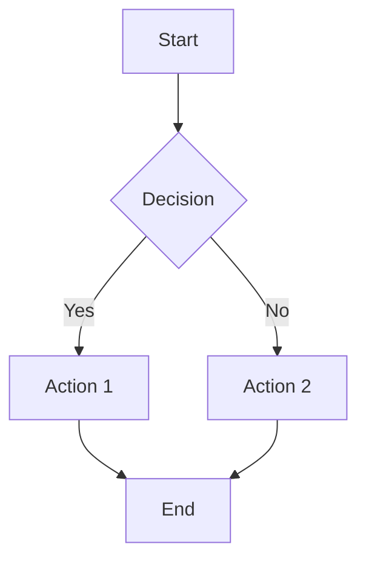
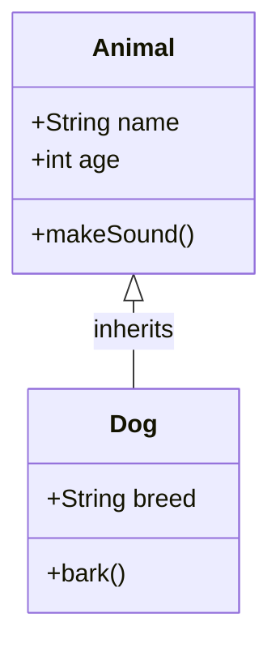
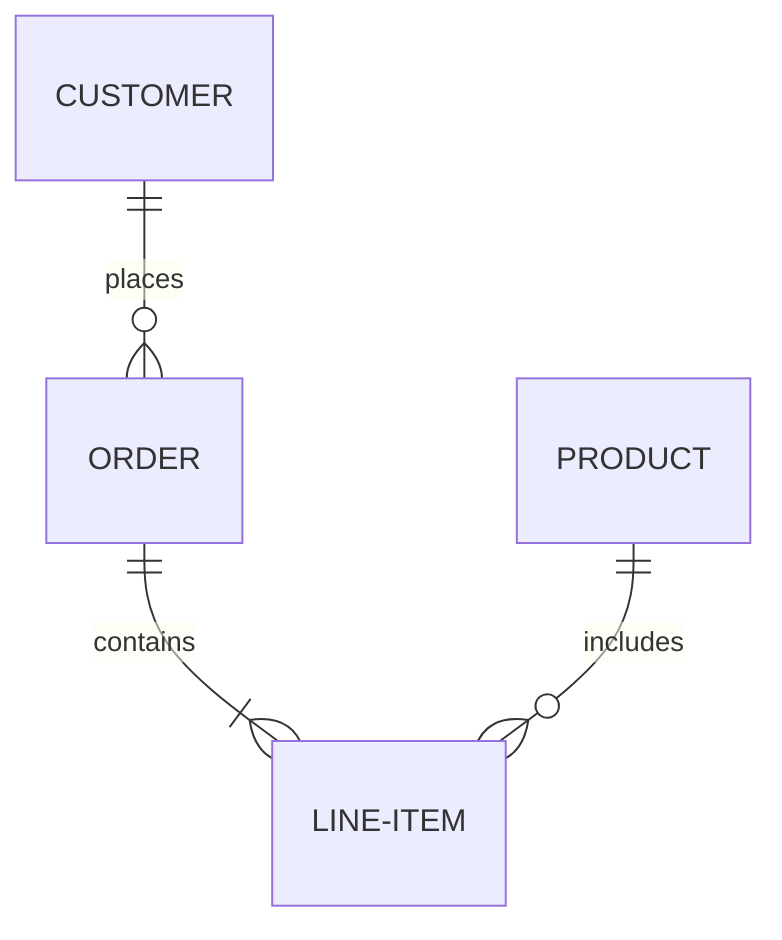
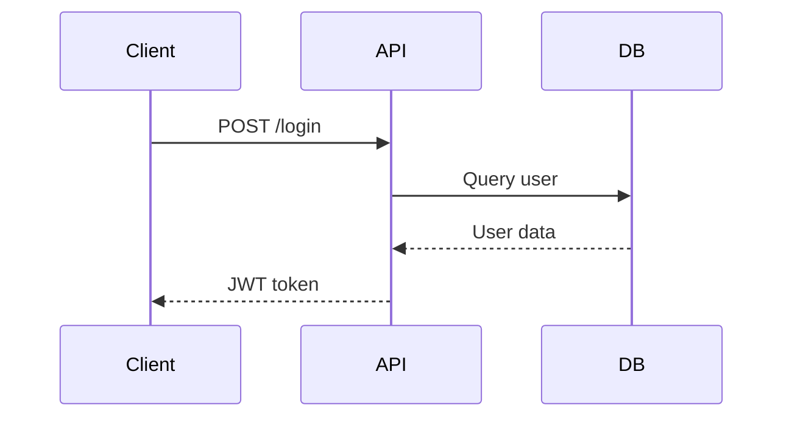
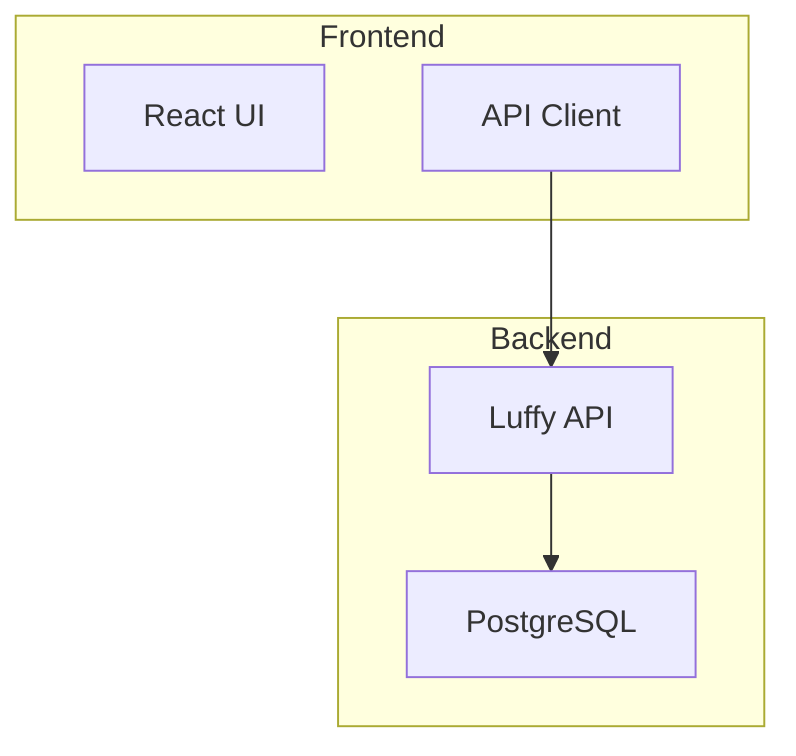
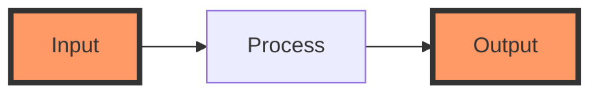

# Visualizer Skill

Specialized skill for working with plaintext visualization formats, with primary support for Mermaid diagrams.

## Overview

This skill provides capabilities for:
1. **Reading** - Parse diagram files and extract visualization data
2. **Understanding** - Interpret structure, relationships, and semantics
3. **Writing** - Generate diagrams from code, data models, or specifications
4. **Visualizing** - Render diagrams inline for immediate viewing and analysis

## Supported Formats

### Mermaid (Primary)

Full support for all Mermaid diagram types:

| Diagram Type | Use Case | Syntax |
|--------------|----------|--------|
| **Flowchart** | Process flows, decision trees | `flowchart TB/LR/RL/BT` |
| **Class Diagram** | Object-oriented designs, data models | `classDiagram` |
| **ER Diagram** | Database schemas, entity relationships | `erDiagram` |
| **Sequence Diagram** | API interactions, message flows | `sequenceDiagram` |
| **State Diagram** | State machines, workflow states | `stateDiagram-v2` |
| **Gantt Chart** | Project timelines, schedules | `gantt` |
| **Git Graph** | Branch strategies, version history | `gitGraph` |
| **User Journey** | UX flows, customer journeys | `journey` |
| **Pie Chart** | Proportions, distributions | `pie` |
| **Quadrant Chart** | Priority matrices, 2x2 frameworks | `quadrantChart` |
| **Timeline** | Historical events, roadmaps | `timeline` |

## Usage Patterns

### Reading Diagrams

**From files:**
```markdown
Read and display the architecture diagram from docs/DIAGRAMS.md
```

**Selective extraction:**
```markdown
Extract just the ER diagram from DIAGRAMS.md
```

### Writing Diagrams

**From code:**
```markdown
Generate a class diagram from these Rust structs
```

**From specifications:**
```markdown
Create a sequence diagram showing the BLAST key exchange flow
```

### Visualizing Diagrams

**HTML rendering (recommended for complex diagrams):**
```markdown
Render this ER diagram as HTML
```

The skill uses a rendering template at `skills/visualizer/_templates/mermaid-render.html` to generate standalone HTML files with:
- Mermaid.js v10 CDN rendering
- Interactive controls (Print/Save as PDF, Download SVG, Refresh)
- Responsive layout with styled interface
- Automatic browser opening for immediate viewing

## Mermaid Syntax Quick Reference

### Flowchart



**Node shapes:**
- `[Text]` - Rectangle
- `(Text)` - Rounded rectangle
- `([Text])` - Stadium
- `[[Text]]` - Subroutine
- `[(Text)]` - Cylinder (database)
- `((Text))` - Circle
- `{Text}` - Diamond (decision)
- `{{Text}}` - Hexagon

**Arrows:**
- `-->` - Solid line
- `-.->` - Dotted line
- `==>` - Thick line
- `--text-->` - Labeled arrow

### Class Diagram



**Relationships:**
- `<|--` - Inheritance
- `*--` - Composition
- `o--` - Aggregation
- `-->` - Association
- `<..` - Dependency
- `..|>` - Realization

### ER Diagram



**Cardinality:**
- `||--||` - One to one
- `||--o{` - One to many
- `}o--o{` - Many to many

### Sequence Diagram



## Rendering Workflow

### HTML Rendering Template

The skill includes a reusable HTML template at `skills/visualizer/_templates/mermaid-render.html`.

**Template placeholders:**
- `{{TITLE}}` - Page title and heading
- `{{DIAGRAM_CONFIG}}` - Mermaid-specific config (e.g., `er: { useMaxWidth: true }`)
- `{{MERMAID_CODE}}` - The complete Mermaid diagram code
- `{{INFO_SECTION}}` - Optional summary/metadata HTML
- `{{FILENAME}}` - Base filename for SVG download

**Rendering process:**
1. Generate or extract Mermaid diagram code
2. Populate template with diagram-specific values
3. Write HTML file to tmp/ or appropriate location
4. Open in browser with `open` command
5. User can view, print as PDF, or download SVG

**Diagram-specific configurations:**

| Diagram Type | Config | Notes |
|--------------|--------|-------|
| ER Diagram | `er: { useMaxWidth: true }` | Responsive width for large schemas |
| Flowchart | `flowchart: { useMaxWidth: true, curve: 'basis' }` | Smooth curves |
| Sequence | `sequence: { useMaxWidth: false }` | Fixed width for readability |
| Class | `class: { useMaxWidth: true }` | Responsive for large hierarchies |

## Advanced Features

### Subgraphs and Grouping



### Styling and Theming



## Best Practices

### For Writing
- Start with the main entities/nodes
- Add relationships progressively
- Use consistent naming conventions
- Group related elements with subgraphs
- Keep complexity manageable (max ~20 nodes per diagram)
- Add labels for clarity

### For Visualizing
- Choose appropriate diagram type for the information
- Use subgraphs to organize large diagrams
- Apply consistent styling
- Test rendering in target environment
